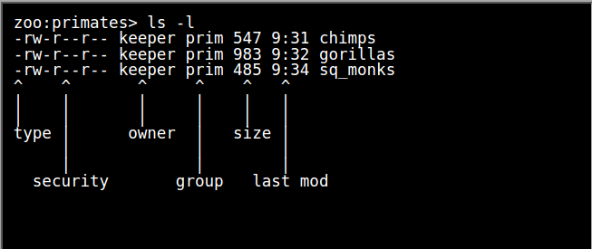
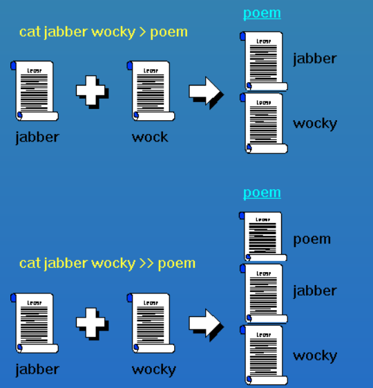
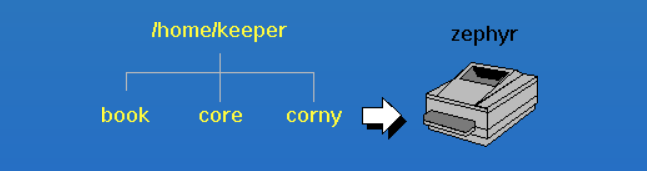
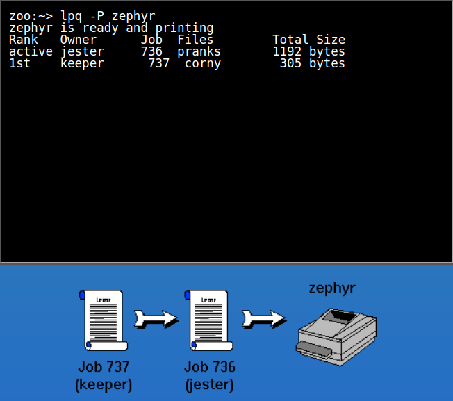
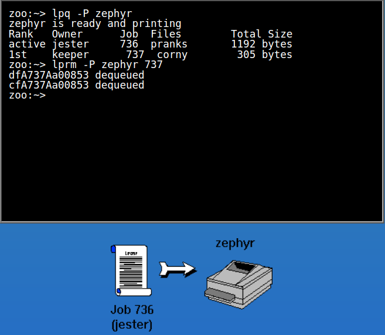
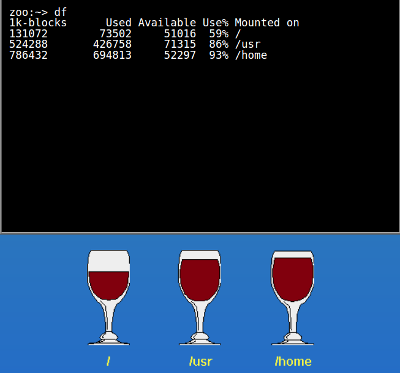
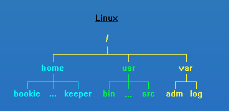
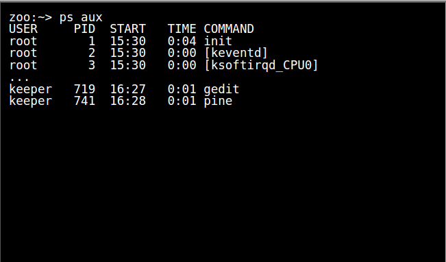

[linuxsurvival](https://linuxsurvival.com/linux-tutorial-introduction/)

## Module 1

### cd

change directory

切换到另一个用户的home目录

> cd ~jester

### more

The "more" command is used to view the contents of a file. 

> more filename

### mkdir

create a directory

> mkdir directory

### mv

move file and directory

"moving" a file from one name to another **rename**

> mv oldname newname

### pwd

print working directory

----------

## Module 2

### cp

copy file: the copy command is "cp" and it has the same syntax as the "mv" command.

> cp filename directory/

> cp filename directory/newname

### rm

remove file

> rm pathname/filename

### rmdir

remove empty directory

> rmdir directory

### security

### chmod

change mode

The first argument you give to the "chmod" command is 'u', 'g', 'o', or a combination of them which specifies which of the three "rwx" sets you want to modify.

> chmod o+w

> chmod ugo-rwx

### groups

see which groups you're in

[linuxsurvival](https://linuxsurvival.com/linux-tutorial-module-3-introduction/)

## Module 3

### man

manual 

> man man 

try to find what you want 

> man -k keyword 

**you can ignore any commands which have a section other than '1'.**

### finger

The finger displays information about the system users.

### find

search for files in a directory hierarchy

> find startplace -name filename

> find ~ -name "毕业设计*"

### cat

concatenate(串联)

combined files and default will send its output to your screen

> cat joke-1 joke-2

一般会有人使用cat来查看文件内容，但是还是建议使用more来查看

send the output from a command such as "cat" to a file, you can use either '>' or '>>'.

('>' overwrite),('>>' append),**arrow pointing to where you want the output to go.** **redirecting output**

### line print

#### lpr

将文本发送到打印设备
> lpr -P zephyr corny

### lpq

line printer queue

check on the status of your print job

### lprm

line printer remove

cancel your print job

## Module 4

### cp,rm

The regular "cp" command will not let you copy directories, but if you use the "-r" option, it will. 

"rmdir" command only deletes empty.The command that allows you to remove an entire directory tree is "rm -r"

### 磁盘文与文件系统

#### df

> disk free： disk usage list

Notice that the "Used" and "Available" columns do not add up to the "1k-blocks" (total) column. That is because a percentage of the disk is always set aside for administrative use.

> The "Mounted on" column shows where the disks reside in your filesystem tree.

#### 硬盘挂载在文件系统

Each (hard drive)(硬盘) is "mounted" on a particular directory in that tree. 

For example, the first hard drive is mounted on "/", the root of the tree. Everything contained on that drive has been colored yellow in the diagram at bottom right. The second drive is mounted on "/home". That means that any files or directories under "/home" in the tree will be stored on the second drive rather than on the first one. They are colored blue. Similarly, the third drive has been mounted on "/usr". Its contents have been colored green.

------------

figure out which disk contains a particular file or directory and then display statistics **only for that disk**.

>  find out how much disk space is free on the disk where your current directory resides

> df .

### ps

> process status

To get a detailed list of all processes, type

> ps aux

- USER - the process owner

- PID - the process ID (you will need this)

- START - the date or time when this process started

- TIME - **the amount of CPU time used by this process**

- COMMAND - **the command that started the process**

### 管道

'|'： the only difference is that it sends the output of a command as the input to another command

The output of "cat joke-1 joke-2" is sent directly to the printer, rather than to a file. This is a very powerful technique

>   cat joke-1 joke-2 | lpr -P zephyr

### grep

if you wanted to find every occurrence of the word "gold" in file "metals", you would type

> grep gold metals

### kill

do not assume that the command worked

> kill PID

grep" didn't display the line of headings because it didn't contain the word "rogue". 

PID -- it's the first one with a number

"kill immediately". To tell a process to die immediately, 

> kill -9 PID

