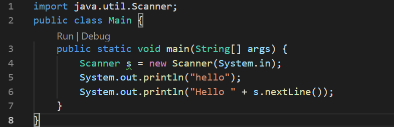
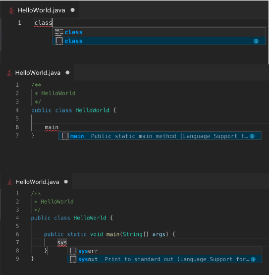

## Java输入问题

> 会在该IDE中打开一个输入窗口,重点是更改console: integratedTerminal

**launch.json 这个文件在.vscode目录下**
```java
{
    "configurations": [
        {
            "type": "java",
            "name": "CodeLens (Launch) - Main",
            "request": "launch",
            "mainClass": "Main",
            "console": "integratedTerminal"
        },
        {
            "type": "java",
            "name": "CodeLens (Launch) - Solution",
            "request": "launch",
            "mainClass": "Solution",
            "console": "integratedTerminal"
        }
    ]
}
```


调试的时候直接点击debug




## vscode 使用cmder作为终端

更改settings

1. 注释原来的cmd.exe
2. 添加新的配置，路径为自己的cmder安装位置

```json
    // "terminal.integrated.shell.windows": "C:\\windows\\System32\\cmd.exe",
    "terminal.integrated.shell.windows": "cmd.exe",
    "terminal.integrated.env.windows": {
    "CMDER_ROOT": "C:\\tools\\cmder"
    },
```


## 快速运行一个Java脚本

[Visual Studio Code for Java: the Ultimate Guide 2019](https://dzone.com/articles/visual-studio-code-for-java-the-ultimate-guide-201)




## Override方法


## vscode插件

### setter & getter方法

+ 插件  [Java Code Generators](https://marketplace.visualstudio.com/items?itemName=sohibe.java-generate-setters-getters)


### Prettier - Code formatter

> 保存自动格式美化代码

settings设置editor.formatOnSave 为true,即勾选


## 快捷键

1. ctrl+enter 下一行
2. ctrl+` 打开终端
3. ctrl+shift+a 快速注释代码块
4. ctrl+end  快速到文件末尾
