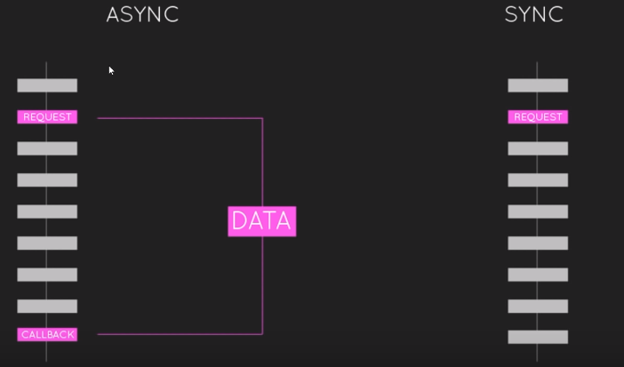

## web前端异步请求后端

**Javascript**

１. [Youtube-Video:Javascript对于Web的异步介绍](https://www.youtube.com/watch?v=YxWMxJONp7E)

```javascript
// 样例
//同步
var article = readSync(article_loc);
console.log(article);
var authors = readSync(authors_loc);
console.log(authors);


//=====================
//异步
readAsync(article_loc,function(){
    console.log(article);
})

readAsync(authors_loc,function(){
    console.log(authors);
})


```




----------


2. [Youtube-Video:AJAX Requests](https://www.youtube.com/watch?v=h0ZUpPiV1ac&list=PL4cUxeGkcC9jAhrjtZ9U93UMIhnCc44MH&index=2)

```javascript

//讲请求回来的数据,传递给绑定的function参数
window.onload = function(){
    //javscript中原始的ajax请求
    var http = new XMLHttpRequest();

    http.onreadystatechange = function(){
        if(http.readyState == 4 && http.status == 200)
            console.log(JSON.parse(http.response));
    }
    // true means asyn,false means syn
    http.open("GET","data/tweets.json",true);
    http.send();
    console.log("test")


//使用jquery方式ajax请求，更加简单
    $.get("data/tweets.json",function(data){
        console.log(data);
    });
    console.log("test")

};


```

----------

3. [Youtube-Video:Callback Functions](https://www.youtube.com/watch?v=QRq2zMHlBz4&list=PL4cUxeGkcC9jAhrjtZ9U93UMIhnCc44MH&index=3)
```javascript
//多个连续的异步请求，先请求tweets.json-->friends.json--> video.json
//通过回调函数处理数据,一层层嵌套的方式写代码
windos.onload = function(){

    function handleError(jdXHR,textStatus,error){
        console.log(error);
    }

    //jquery ajax请求
    $.ajax({
        type: "GET",
        url: "data/tweets.json",
        success: cbTweets，
        errror: handleError
    });

    
    function cbTweets(data){
        console.log(data);

        $.ajax({
            type: "GET",
            url: "data/friends.json",
            success: cbFriends，
            errror: handleError
        });
    }

    function cbFriends(data){
        console.log(data);

        $.ajax({
            type: "GET",
            url: "data/friends.json",
            success: function(data){
                console.log(data);
            }，
            errror: handleError
        });
    }


}

```


----------

4. [Youtube-Video:Promises](https://www.youtube.com/watch?v=yswb4SkDoj0&list=PL4cUxeGkcC9jAhrjtZ9U93UMIhnCc44MH&index=4)

```javascript
//通过使用jquery提供的Promise接口，代码量减少，便于维护和管理
//promise中最常用的方法是then
windos.onload = function(){
    $.get("data/tweets.json").then(function(tweets){
        console.log(tweets);
        return $.get("data/friends.json");
    }).then(function(friends){
        console.log(friends);
        return $.get("data/videos.json");
    }).then(function(videos){
        console.log(videos)
    }).catch(function(error){
        console.log(error);
    });
｝

```


5. [Youtube-Video:Generators](https://www.youtube.com/watch?v=pnS2lBQuLGc&list=PL4cUxeGkcC9jAhrjtZ9U93UMIhnCc44MH&index=5)

```javascript
//生成器方式处理嵌套异步请求

window.onload = function(){

    genWrap(function*(){
        var tweets = yield $.get("data/tweets.json");
        console.log(tweets);
        var friends = yield $.get("data/friends.json");
        console.log(friends)
        var videos = yield $.get("data/videos.json");
        console.log(videos);
    });

    function genWrap(generator){
        var gen = generator;
        function handle(yielded){
            if(!yielded.done){
                yielded.value.then(function(data){
                    return handle(gen.next(data));
                });
            }
        }
    }


};


```